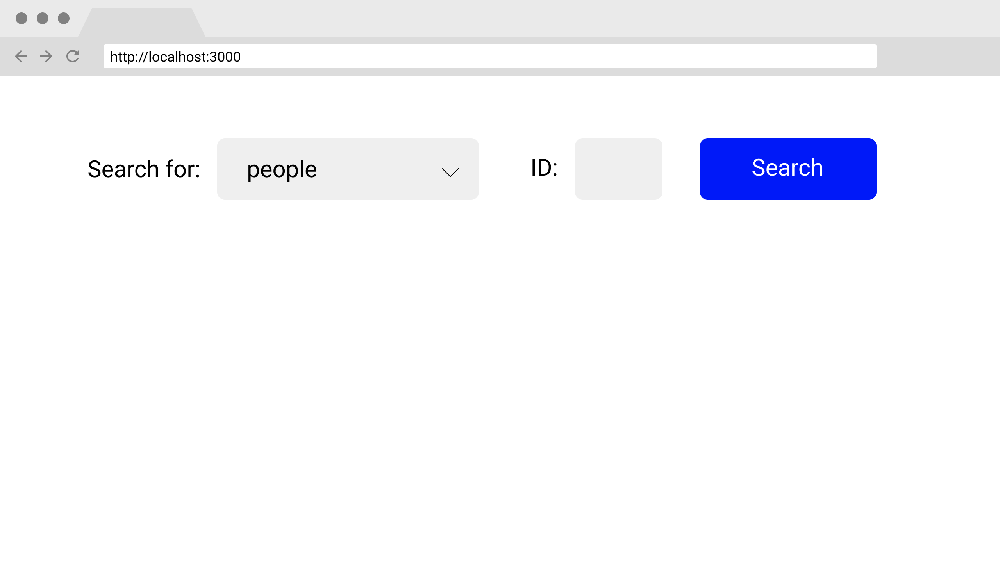
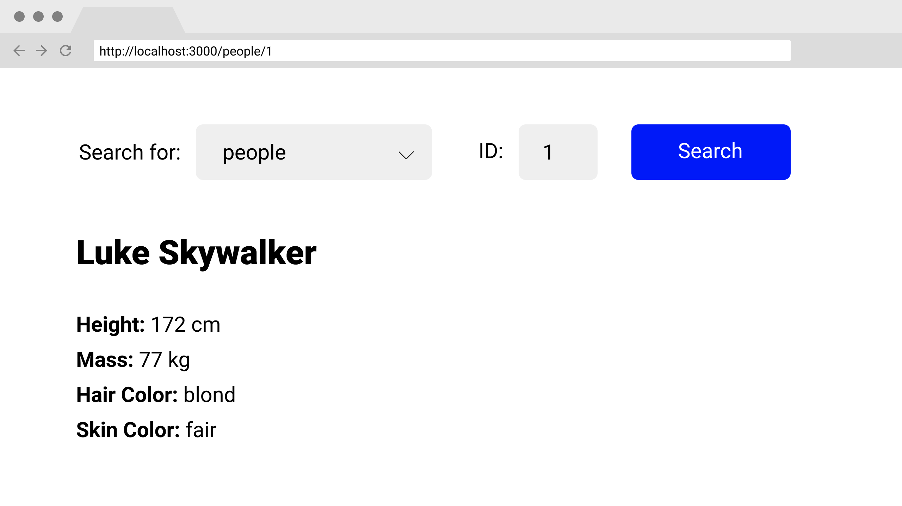
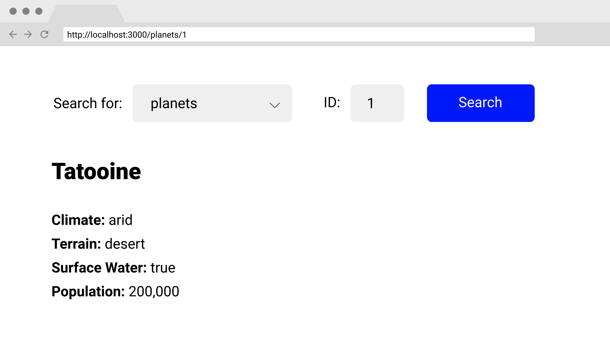

# Luke APIwalker

You have been given a task as a front-end developer to create a front-end app to navigate the [Star Wars API.](https://swapi.dev)






In addition to the index route, you should have a route to display specific characters and a route to display specific planets. Here are a couple considerations to keep in mind:

- Since the search form is shown on every route and we want to preserve its state across route changes, does it need to be rendered inside each route component?

- Typically we pass an empty array as the second argument to our useEffect calls to ensure that the API request is only made once. How can we force the useEffect callback to also run when the ID for a given route pattern has changed? Hint: think about putting a variable inside that array.
By reading the Star Wars API documentation, create a User Interface that does the following tasks:

- [x] Create a dropdown menu that allows the user to choose the resource they are looking for

- [x] Next to the dropdown menu, create an input field that accepts a number that will be used to query a specific id.

- [x] Add a button to allow them to send a request to the API.

- [x] On submission, navigate to the appropriate route and render at least 4 attributes for that specific resource.

- [x] If the request is unsuccessful, create an error message that says "These aren't the droids you're looking for" with a picture of Obi-Wan Kenobi.

- [ ] NINJA BONUS: If the resource is "people", output the name of the character's homeworld (you may need to make another request)

- [ ] NINJA BONUS: If the resource is "people" render a link to their homeworld (a specific planet). It's okay if the link text is simply "homeworld."

- [ ] NINJA BONUS: Add additional resources aside from people and planets to the dropdown.

#

To use the code
- create a new react app called ``luke_api_walker`` 

```
npx create-react-app luke_api_walker
```

and then replace the ``src`` folder with [this folder]() 