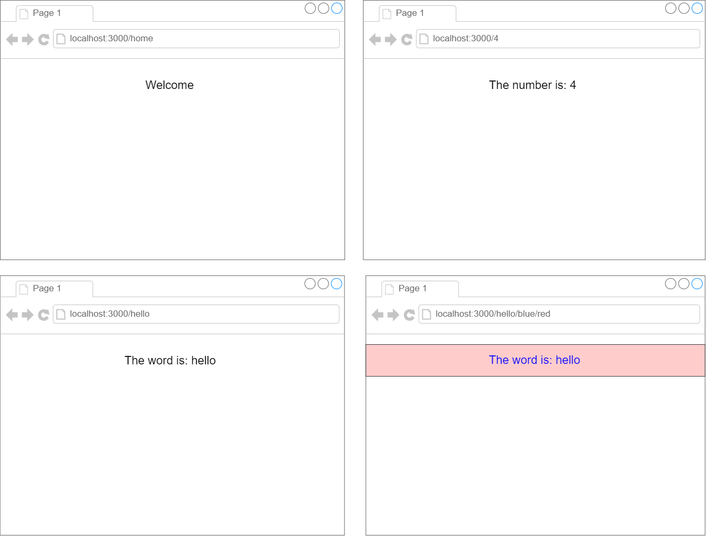

# Routing Practice

Create a simple React app that can handle the following routes:

1. localhost:3000/home: This should display the home page, with a generic "Welcome" heading

2. localhost:3000/4: This should display the number "4", or any other number that was sent through

3. localhost:3000/hello: This should display the word "hello" or any other word that was sent through

4. localhost:3000/hello/blue/red: This should display the word "hello" in blue text with a red background. It should work with any other valid word and colors.

Hint: use the ``isNaN`` method (is Not a Number). For example: ``isNaN(+"35")`` is ``false``, ``isNaN(+"hello")`` is ``true``



- [x] Create localhost:3000/home: This should display the home page, with a generic "Welcome" heading

- [x] Create localhost:3000/4: This should display the number "4", or any other number that was sent through

- [x] Create localhost:3000/hello: This should display the word "hello" or any other word that was sent through


- [x] Create localhost:3000/hello/blue/red: This should display the word "hello" in blue text with a red background. It should work with any other valid word and colors
To use the code
- create a new react app called ``routingpractice`` 

```
npx create-react-app routingpractice
```

and then replace the ``src`` folder with [this folder]() 

