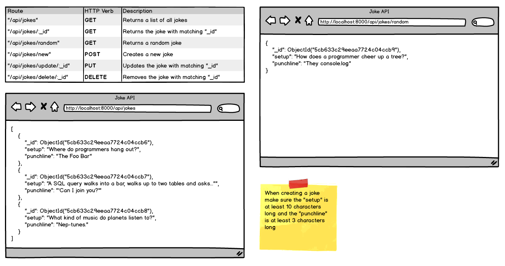

#Jokes API
To solidify what we've read about mongoose commands and express, lets create a new express project from scratch called "Jokes."

- [x] Create a project folder named "Jokes"

- [x] within "Jokes" create a modularized folder structure (server ==> controllers, routes, models, config, server.js)

- [x] initialize a package json file using npm

- [x] install express and mongoose

create a mongoose.config.js file and setup your mongoose.connect function

create a jokes.model.js, jokes.controller.js, and a jokes.routes.js in the applicable folders

- [x] in the jokes.model file create a JokeSchema and export the mongoose.model("joke", JokeSchema)

- [x] in the jokes.controller import your model from the models file

- [x] Export a function to get all jokes

- [x] Export a function to get a single joke

- [x] Export a function to create a joke

- [x] Export a function to update a joke

- [x] Export a function to delete a joke

- [x] in the jokes.routes file: import * from your controller file and add an express route for every route listed in the wireframe

- [x] In your server.js file: setup express, import your joke routes, and run your server

- [x] Use Postman to create new jokes and use the browser to view them

- [x] Use Postman to perform the POST DELETE and PUT operations and use the browser to GET them
