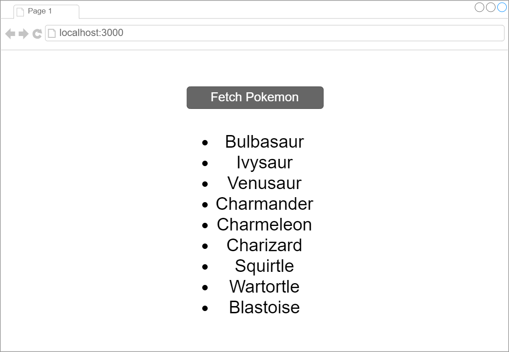

# Axios Pokemon API
Redo the previous assignment using axios. Using the previous lesson as a starting point, create a React project that simply has a button with the text "Fetch Pokemon".

When this is clicked, output the names of all 807 Pokemon using the [Pokemon API](https://pokeapi.co/).

- [x] Create a button to fetch the Pokemon

- [x] Output the names of all 807 Pokemon

