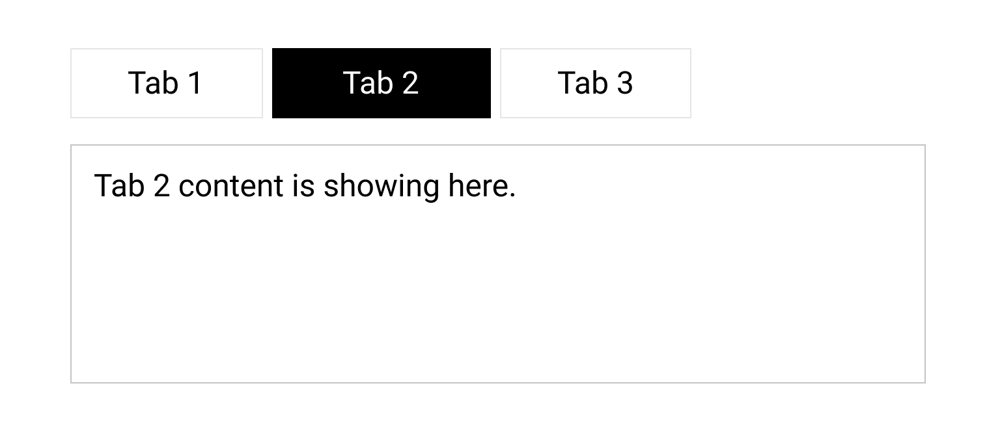

# Tabs
Develop a tabs component that will take in an array of items. Each item will have a label and a content property. When you click on each individual tab header, it should change the state of the tabs so that the correct content is displayed.

- [x] Create a tabs component that accepts an array of varying length.

- [x] Have the tab headers, when clicked on correctly show the appropriate content below.

- [ ] Ninja Bonus: Allow each tab to optionally have a callback which gets fired when the relevant tab header is clicked.

- [x] Ninja Bonus: Add some CSS animations to the tab switching to smooth out the user experience.

- [ ] Sensei Bonus: Add a JavaScript animation to the tab switching action.